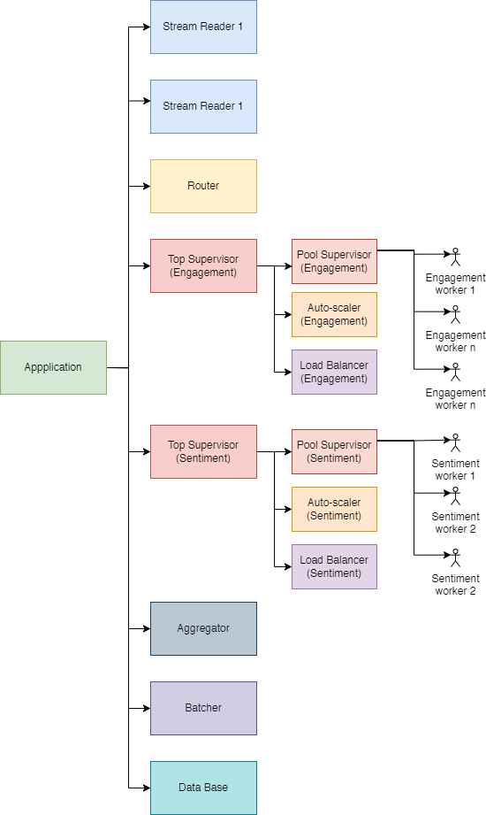
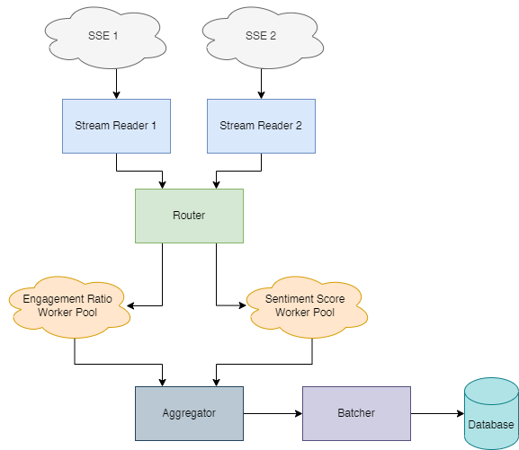
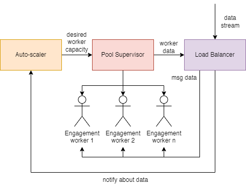
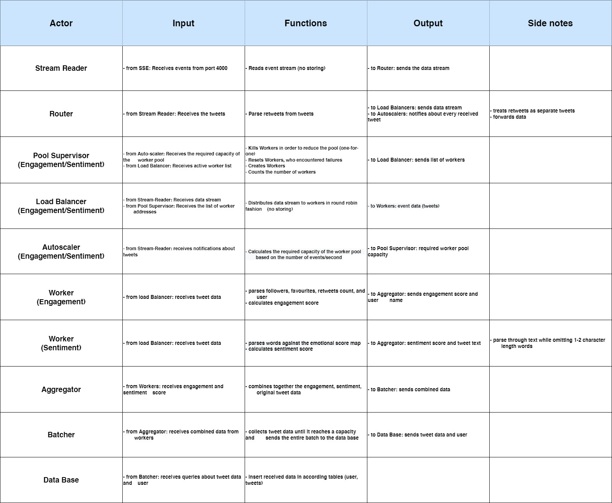

# Electric-Porcupine-PTR2
## The Task
The focus of this laboratory work is to expand on the notion of processing tweets and loading
streaming data into a database. You should start by continuing what you did in the first lab and
implementing the ability to spawn multiple worker pools. You will need two pools of workers
which will be calculating the Sentiment Score and Engagement Ratio of tweets respectively.
Following, the results of these calculations should be reconnected with the tweets, grouped in
batches and, finally, saved to a database.

## Checkpoint #1
### Application Supervision Tree
Here is the diagram of the supervision tree for the application.  
Mainly, there will be 5 supervisors, Application-level supervisor, Top Supervisor(Engagement Ratio/Sentiment Score), Pool Supervisor(Engagement Ratio/Sentiment Score)    

### System Architecture Diagram
Diagram showcasing the architecture, clouds representing higher level abstractions  

### Data Flow
Data flow diagram showcasing the supervision inside worker pools  

### Actors' Endpoints

### Language of Choice: Elixir
### Libraries: